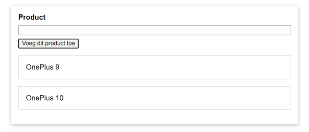

# Vue - Opdracht 2

Voor deze opdracht gaan we een kleine applicatie bouwen in JavaScript, die we nadien ook in Vue gaan bouwen. Gebruik hiervoor de startbestanden van deze repository!

Het is de bedoeling dat je met JavaScript ervoor zorgt dat de gebruiker de naam van een product kan ingeven in het inputveld. Wanneer er op de knop wordt geklikt wordt de ingegeven tekst als een lijstitem toegevoegd aan de ongeordende lijst en wordt het inputveld leeg gemaakt

- Installeer de nodige packages 
- Compileer de Sass code naar css
- Voeg de nodige functionaliteit toe aan het app.js-bestand!

        npm install
        npm run dev